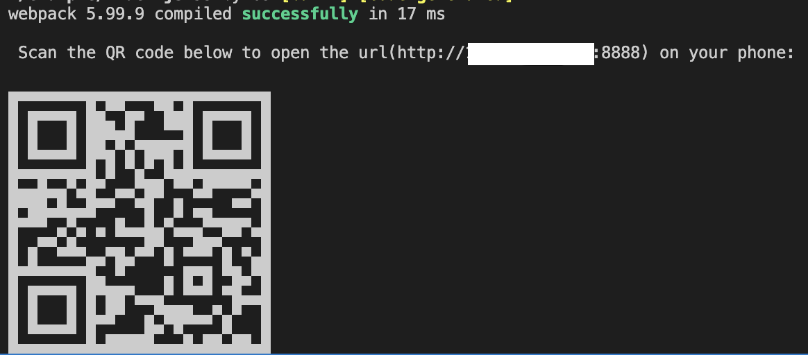

# qrcode-webpack-plugin

generate qrcode when start webpack dev server

## usage

```bash
npm install qrcode-webpack-plugin -D
# or
yarn add qrcode-webpack-plugin -D
```

```js
const QRcodeWebpackPlugin = require("qrcode-webpack-plugin");

module.exports = {
    mode: "development",
    entry: "./index.js",
    devServer: {
        port: "8888",
    },
    plugins: [new QRcodeWebpackPlugin()],
};
```

## options
| param | description | type | required|
| ----  | ---- | ----  |  ---- |
|  small | qrcode size is small or not | boolean | false |


## example


## license
[MIT](./LICENSE)